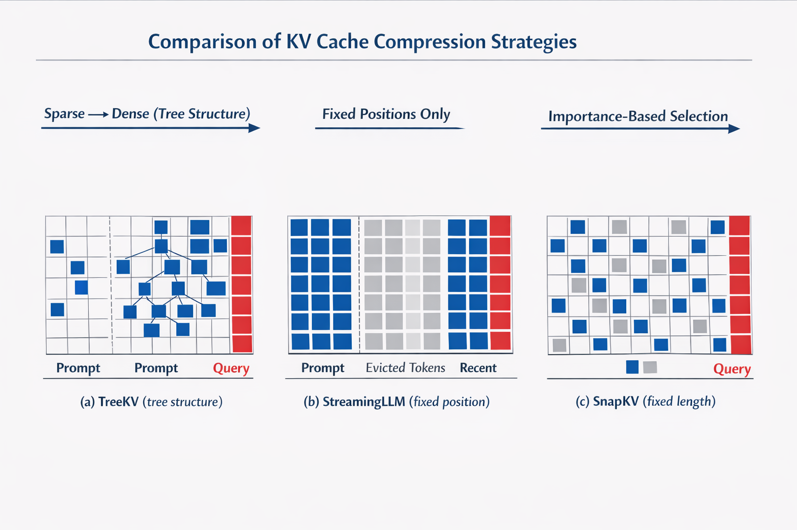

# LLM Efficient Inference：KV Cache 压缩方法复现与对比

在 **Pythia-70M** 上复现 StreamingLLM、SnapKV 和 TreeKV，并提出三种 SnapKV 改进（Sink 保护、Adaptive Per-Head、组合），在 wikitext-2 与 PG-19 上评测 PPL 与推理性能。

This project is my **individual** implementation for AI2801 NLP.

**Group project (TieredKV)** — [AI2801_NLPProject_Group](https://github.com/6chHenry/AI2801_NLPProject_Group) · Personal repo also published as [KV_Cache_Compression](https://github.com/6chHenry/KV_Cache_Compression)



---

## 方法概述

| 文件 | 方法 | 核心思想 |
| ------ | ------ | ---------- |
| `baseline.py` | Full KV Cache | 标准自回归推理，全量保留 KV Cache |
| `streaming_llm.py` | StreamingLLM | 保留前 k_sink 个 Sink token + 最近 window_size 个 token，丢弃中间 |
| `snapkv.py` | SnapKV | Prefill 阶段用末尾 obs_window 个 query 的 attention 选出重要 KV 位置 |
| `treekv.py` | TreeKV | 几何预算分配：历史区按块分配 top-k 预算，近块多远块少（树形结构） |
| `improved.py` | 三种改进 | 在 SnapKV 基础上改进选取策略（见下方分析） |

---

## 环境安装

```bash
conda create -n llm_accel python=3.10
conda activate llm_accel
pip install -r requirements.txt
# 或：pip install torch transformers datasets numpy
```

---

## 数据准备

```bash
cd utils/
python prepare_data.py
```

自动下载并缓存到 `./cache/`：

- Pythia-70M 模型权重
- wikitext-2-raw-v1 测试集
- pg-19 测试集前 5 个样本（`cache/pg19_test_5samples.json`）

---

## 运行各方法

```bash
cd src/

# Baseline（Full KV）
python baseline.py

# StreamingLLM（k_sink=4, window=512）
python streaming_llm.py --k_sink 4 --window_size 512 --max_eval_tokens 2048

# SnapKV（k_ratio=0.5）
python snapkv.py --k_ratio 0.5 --obs_window 32 --local_window 32

# TreeKV（n_levels=4 → 块预算比 1:2:4:8）
python treekv.py --k_ratio 0.5 --obs_window 32 --local_window 32 --n_levels 4

# 改进方法（三种对比）
python improved.py --k_ratio 0.5 --k_sink 4 --obs_window 32 --local_window 32

# Query pooling 消融（固定 backbone=snapkv_sink_adaptive）
python improved.py --k_ratio 0.5 --k_sink 4 --obs_window 32 --local_window 32 --query_pool mean --exp_lambda 0.9 --topk_q 8
python improved.py --k_ratio 0.5 --k_sink 4 --obs_window 32 --local_window 32 --query_pool exp --exp_lambda 0.9 --topk_q 8
python improved.py --k_ratio 0.5 --k_sink 4 --obs_window 32 --local_window 32 --query_pool max --exp_lambda 0.9 --topk_q 8
python improved.py --k_ratio 0.5 --k_sink 4 --obs_window 32 --local_window 32 --query_pool topk_mean --exp_lambda 0.9 --topk_q 8
```

---

## 实验结果

### PPL 对比（matched protocol，推荐）

所有压缩方法与 Full KV 使用**相同**评测流程：prefill 上下文（最多 1536 token）→ 可选压缩 KV → 对 512-token target 前向；PG-19 为 **20 本书** token 加权均值 ± 标准差（`fp32` + `eager`）。

| 方法 | WikiText-2 PPL ↓ | PG-19 PPL ↓ | Δ Wiki |
| ------ | :--------------: | :-----------: | :------: |
| Baseline (Full KV) | **39.38** | **36.67±11.92** | — |
| SnapKV (k_ratio=0.5) | 42.24 | — | +7.3% |
| TreeKV (k_ratio=0.5, n_levels=4) | **41.78** | 37.18±12.01 | +6.1% |
| + Sink 保护 (snapkv_sink)† | 42.23 | 31.30‡ | +7.2% |
| + Adaptive Per-Head† | 42.24 | 31.30‡ | +7.3% |
| + Sink + Adaptive† | 42.23 | 31.30‡ | +7.2% |

† 改进方法仍用**滑动窗口**协议（见下表），尚未在 20-book matched 流程上重跑。  
‡ 单本书、8192 token、滑动窗口；与上表 PG-19 不可直接对比。

> 数据来源：`results/results_baseline.json`（Wiki 与 matched baseline 对齐）、`results_pg19_suite_r050.json`（20-book PG-19 + TreeKV）、`results/results_snapkv.json`、`results/results_improved.json`。

### PPL 对比（滑动窗口，短 prompt 历史结果）

早期脚本默认协议：wikitext-2 全量 test；PG-19 **第 1 本书**前 8192 token；`max_length=2048`, `stride=512`。

| 方法 | wikitext-2 PPL ↓ | pg-19 PPL ↓ |
| ------ | :--------------: | :---------: |
| Baseline (Full KV) | 39.85 | 13.75 |
| StreamingLLM (k_sink=4, window=512) | 302.41 | 167.15 |
| SnapKV (k_ratio=0.5) | 42.24 | 31.30 |
| TreeKV (k_ratio=0.5, n_levels=4) | 41.90 | 31.16 |
| + Sink 保护 | 42.23 | 31.30 |
| + Adaptive Per-Head | 42.24 | 31.30 |
| + Sink + Adaptive | 42.23 | 31.30 |

PG-19 **5 本书**滑动窗口 Baseline 均值：**16.67±4.2**（`results/results_baseline_pg19_multi.json`）。

### 长上下文速度（4096-token prefill + 100-token decode）

| 方法 | KV len | TTFT (s) | 端到端 TP (tok/s) ↑ | decode TP (tok/s) |
| ------ | :----: | :------: | :-----------------: | :---------------: |
| Full KV | 4096 | 0.64 | 3497 | 180 |
| TreeKV (k_ratio=0.5) | 2064 | 0.40 | **4906** | 217 |

> 配置：Pythia-70M，`fp32` + `eager`，PG-19 第 1 本书 prefill。TreeKV 在真实长 prompt 下 KV 减半，TTFT 降约 38%，端到端吞吐升约 **40%**（`results/results_pg19_suite.json`）。

### 短 prompt 速度 & 显存（prompt=21, gen=200）

| 方法 | decode tps ↑ | 峰值显存 (MB) ↓ | KV 压缩比 |
| ------ | :----------: | :-------------: | :-------: |
| Baseline (Full KV) | 277 | 148 | 1× |
| StreamingLLM (k_sink=4, window=512) | **306** | **148** | ~0.43× |
| SnapKV (k_ratio=0.5) | 231 | 284 | 0.5× |
| TreeKV (k_ratio=0.5, n_levels=4) | 45 | 286 | 0.5× |
| + Sink 保护 | 226 | 289 | 0.5× |
| + Adaptive Per-Head | 223 | 289 | 0.5× |
| + Sink + Adaptive | 223 | 289 | 0.5× |

> Baseline 使用 `sdpa`+`fp16`；压缩方法为 `eager`+`fp32` 以取 attention，短 prompt 下 TreeKV decode 偏慢不代表长上下文表现。

### Query Pooling Ablation（新增）

在固定 `snapkv_sink_adaptive` 结构与相同压缩预算下，只替换 query 维聚合策略：

- `mean`: 等权平均（原始 SnapKV 风格）
- `exp`: 指数衰减加权（`lambda=0.9`，越近 query 权重越高）
- `max`: 取 query 维最大值（强调“被任一近期 query 强关注”的 token）
- `topk_mean`: query 维 top-k 平均（`topk_q=8`）

| query pooling | wikitext-2 PPL ↓ | pg-19 PPL ↓ | decode tps ↑ | peak mem (MB) ↓ |
| ------ | :--------------: | :---------: | :----------: | :-------------: |
| mean | 42.2271 | 31.3026 | 116.13 | 290.8 |
| exp (`lambda=0.9`) | **42.1823** | **31.2478** | 206.84 | 290.8 |
| max | 42.6766 | 31.3269 | **218.10** | **288.6** |
| topk_mean (`topk_q=8`) | 42.3940 | 31.3013 | 203.56 | 290.8 |

> 数据文件：`results/results_query_pooling_ablation.json`。  
> 说明：本消融与 `sink/adaptive` 结构改进正交，可视作“结构选择 × query 聚合选择”的二维设计空间。

---

## 结果分析

### 评测协议差异（重要）

早期表格中 Baseline PG-19 **13.75** 与压缩方法 **~31** 相差约 2.3×，主要来自**协议不一致**（滑动窗口 vs compress-and-evaluate），而非 TreeKV 本身劣化很多。在 matched protocol + 20-book PG-19 下，Full KV **36.67** vs TreeKV **37.18**（+1.4%），与 WikiText +6.1% 的趋势一致。

### StreamingLLM

PPL 远高于 Baseline（302 vs 40）是预期现象：设计目标是无限长流式生成，而非最小化 PPL。`k_sink=4, window=512` 时有效上下文约 516 token。优势是**显存恒定**（148 MB）且短 prompt decode 最快（306 tps）。

### SnapKV

50% KV 压缩下 WikiText PPL 约 +7.3%（39.38 → 42.24），是有效的均匀 top-k 基线。显存高于 Baseline 因 `eager`+`fp32` 中间 attention 开销；KV 本体更小。

### TreeKV

Matched protocol 下 WikiText **41.78**、PG-19 **37.18±12.01**，在相同压缩率下优于 SnapKV（42.24），体现几何预算（块比 1:2:4:8）对局部性历史的适配。

长 prompt（4096 prefill）下 KV 从 4096 压至 2064，TTFT 与端到端吞吐显著优于 Full KV；短 prompt micro-benchmark 中 decode 仅 45 tps，因 prompt 过短、压缩未体现收益。

### 改进方法（SnapKV 变体）

三种改进在滑动窗口协议下 PPL 差异 **<0.01**，未能拉开差距：

1. **Pythia-70M 仅 8 heads**：entropy 加权与等权几乎等价；
2. **Sink 已被自然选中**：50% 压缩率下前 4 token 常进入 top-k；
3. **总预算固定**：选取策略可优化空间有限。

结论：在 <1B 小模型上，KV 选取精细化收益有限；更大模型、更长上下文更值得探索（也是小组 TieredKV 的动机）。

### Query Pooling 进一步分析（新增）

在固定 backbone 下，`exp` 在两项 PPL 上均优于 `mean`，支持“近期 query 更重要”的假设；`max` 虽然在速度略高，但 PPL 最差，说明它更激进且容易引入噪声；`topk_mean` 介于两者之间，表现更稳健但未超过 `exp`。因此当前默认推荐 `exp(lambda=0.9)`，并建议后续在更大模型上继续做 `lambda` 敏感性分析。

---

## 参考文献

- Xiao et al., *Efficient Streaming Language Models with Attention Sinks*, 2023. [[arxiv]](https://arxiv.org/abs/2309.17453) [[code]](https://github.com/mit-han-lab/streaming-llm)
- Li et al., *SnapKV: LLM Knows What You are Looking for Before Generation*, 2024. [[arxiv]](https://arxiv.org/abs/2404.14469) [[code]](https://github.com/FasterDecoding/SnapKV)
- Lian et al., *TreeKV: Smooth Key-Value Cache Compression with Tree Structures*, IJCAI 2025. [[arxiv]](https://arxiv.org/abs/2501.04987)
- Biderman et al., *Pythia: A Suite for Analyzing Large Language Models Across Training and Scaling*, 2023. [[model]](https://huggingface.co/EleutherAI/pythia-70m)
